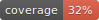

# gspx: Graph Signal Processing on eXtension algebras


Python package for implementing graph signal processing on extension (higher dimensional) algebras (currently, only quaternions)


Higher-dimensional algebras over the real numbers, beyond the complex numbers, present the benefit of encoding many features (dimensions, channels, you name it) within a single element. As such, differently from vector spaces, algebraic operations deal with all these features holistically, at once.

This package aims to implement an extension of [graph signal processing (GSP)](https://arxiv.org/pdf/1712.00468) to higher-dimensional algebras, starting with [quaternions](https://en.wikipedia.org/wiki/Quaternion), aiming towards dealing with signals having elements in a Clifford algebra. This is part of an ongoing doctorate research at the Federal University of Pernambuco (UFPE).

# Getting started

## Quaternion matrices
Using the class `QMatrix`, one can manipulate quaternion matrices
with methods suitable for graph operations.

One can instantiate the object either from four real-valued matrices,
each representing one quaternionic dimension (`1`, `i`, `j` and `k`),
```py
>>> import numpy as np
>>> from gspx.qgsp import QMatrix
>>> M1 = np.random.default_rng(seed=2).integers(2, size=(3, 3))
>>> Mi = np.random.default_rng(seed=3).integers(2, size=(3, 3))
>>> Mj = np.random.default_rng(seed=4).integers(2, size=(3, 3))
>>> Mk = np.random.default_rng(seed=5).integers(2, size=(3, 3))
>>> M = QMatrix([M1, Mi, Mj, Mk])
>>> M
Quaternion-valued array of shape (3, 3):
[[Quaternion(1.0, 1.0, 1.0, 1.0) Quaternion(0.0, 0.0, 1.0, 1.0)
  Quaternion(0.0, 0.0, 1.0, 0.0)]
 [Quaternion(0.0, 0.0, 1.0, 1.0) Quaternion(0.0, 0.0, 1.0, 0.0)
  Quaternion(1.0, 1.0, 1.0, 1.0)]
 [Quaternion(0.0, 1.0, 1.0, 1.0) Quaternion(0.0, 1.0, 0.0, 0.0)
  Quaternion(0.0, 0.0, 0.0, 1.0)]]

>>> # Experiment a visual inspection of the matrix:
>>> M.visualize()
```
or one can create it from a sparse representation, in which each
non-zero entry is a `pyquaternion.Quaternion` instance:
```py
>>> import numpy as np
>>> from pyquaternion import Quaternion
>>> from gspx.qgsp import QMatrix
>>> entries = np.array([
...     Quaternion(0, 2, 2, 0),
...     Quaternion(2, 2, 0, 0)
... ])
>>> idx_nz = (np.array([1, 2]), np.array([1, 1]))
>>> shape = (3, 2)
>>> M = QMatrix.from_sparse(entries, idx_nz, shape)
>>> M
Quaternion-valued array of shape (3, 2):
[[Quaternion(0.0, 0.0, 0.0, 0.0) Quaternion(0.0, 0.0, 0.0, 0.0)]
 [Quaternion(0.0, 0.0, 0.0, 0.0) Quaternion(0.0, 2.0, 2.0, 0.0)]
 [Quaternion(0.0, 0.0, 0.0, 0.0) Quaternion(2.0, 2.0, 0.0, 0.0)]]
```

The arithmetic special methods are also implemented (in which the
multiplication is performed in the matrix sense, not element-wise). See this example of multiplication:
```py
>>> M1
Quaternion-valued array of shape (3, 2):
[[Quaternion(0.0, 0.0, 0.0, 0.0) Quaternion(0.0, 0.0, 0.0, 0.0)]
 [Quaternion(0.0, 0.0, 0.0, 0.0) Quaternion(0.0, 2.0, 2.0, 0.0)]
 [Quaternion(0.0, 0.0, 0.0, 0.0) Quaternion(2.0, 2.0, 0.0, 0.0)]]
>>> M2
Quaternion-valued array of shape (2, 1):
[[Quaternion(0.0, 0.0, 0.0, 0.0)]
 [Quaternion(1.0, 1.0, 1.0, 1.0)]]
>>> M1 * M2
Quaternion-valued array of shape (3, 1):
[[Quaternion(0.0, 0.0, 0.0, 0.0)]
 [Quaternion(-4.0, 4.0, 0.0, 0.0)]
 [Quaternion(0.0, 4.0, 0.0, 4.0)]]
```

The two most important methods, in the context of graph operations,
are the creation of the `complex adjoint` matrix and the `eigendecomposition`.
```py
>>> from gspx.utils.graph import make_sensor
>>> from gspx.qgsp import QMatrix
>>> nvertices = 6
>>> # Let us create four adjacency matrices of sensor graphs
>>> A1, coords = make_sensor(N=nvertices, seed=2)
>>> Ai, _ = make_sensor(N=nvertices, seed=3)
>>> Aj, _ = make_sensor(N=nvertices, seed=4)
>>> Ak, _ = make_sensor(N=nvertices, seed=5)
>>> A = QMatrix([A1, Ai, Aj, Ak])

# The eigendecomposition returns a quaternionic array with the
# standard right eigenvalues, and a QMatrix of eigenvectors
>>> eigq, Vq = A.eigendecompose()

# The complex adjoint can be extracted
>>> ca = A.complex_adjoint
>>> ca.shape
(12, 12)
```

## Instalation

It is recommended to create a separated python environment to run gspx. If one chooses to install [Miniconda](https://docs.conda.io/en/latest/miniconda.html) (my personal favorite), an appropriate environment is created and open through the lines
```sh
conda create --name gspx_env python=3.7
conda activate gspx_env
```

Then, the packages can be pip-installed from Github,

```sh
python -m pip install git+https://github.com/gboaviagem/gspx@main
```

or one may choose to simply install its dependencies:

```sh
git clone https://github.com/gboaviagem/gspx
cd gspx
bash install.sh
```

## Running unit tests locally

When unit tests are implemented, one may run using `pytest`:
```sh
python -m pytest --cov=gspx .
```
To update the coverage badge, run
```sh
rm coverage.svg && coverage-badge -o coverage.svg
```

## Update version in production

Update setup.py version and packages and generate package by running:

```sh
python setup.py sdist bdist_wheel
```

## Acknowledgements

The pre-commit hook used to verify codestyle was copied from
[https://github.com/cbrueffer/pep8-git-hook](https://github.com/cbrueffer/pep8-git-hook).
